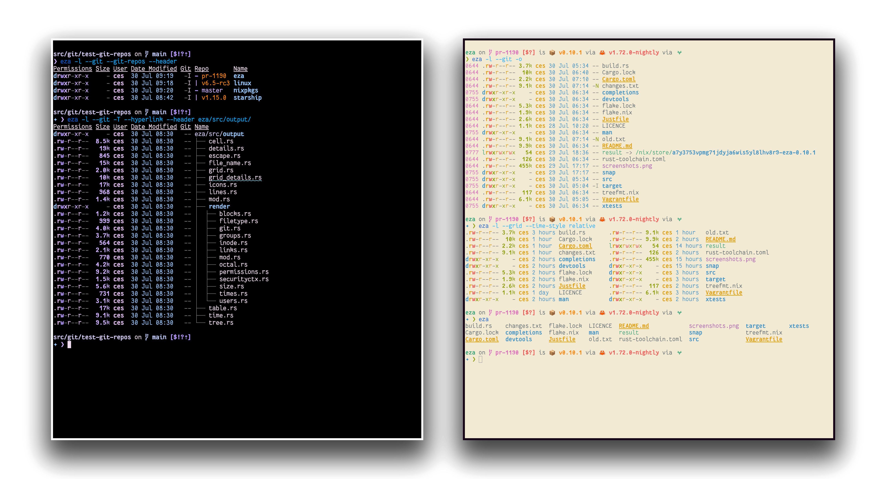

# eza

A modern, maintained replacement for ls.

---

**eza** is a modern, maintained replacement for the venerable file-listing command-line program `ls` that ships with Unix and Linux operating systems, giving it more features and better defaults.
It uses colours to distinguish file types and metadata.
It knows about symlinks, extended attributes, and Git.
And it’s **small**, **fast**, and just **one single binary**.

By deliberately making some decisions differently, eza attempts to be a more featureful, more user-friendly version of `ls`.

---

**eza** features not in exa (non-exhaustive):

- Fixes [“The Grid Bug”](https://github.com/eza-community/eza/issues/66#issuecomment-1656758327) introduced in exa 2021.
- Hyperlink support.
- Mount point details.
- Selinux context output.
- Git repo status output.
- Human readable relative dates.
- Several security fixes.
- Support for `bright` terminal colours.
- Many smaller bug fixes/changes!

...and like, so much more that it became exhausting to update this all the time.
Like seriously, we have a lot of good stuff.
